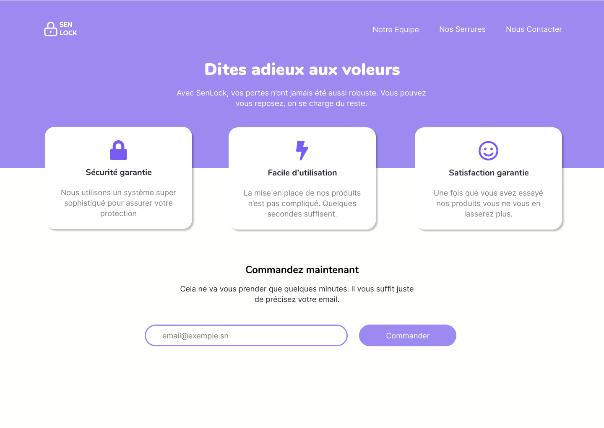

# BattleDev #3

Voici la maquette à réaliser en **1 heure de temps**

## Ressources

Les polices utilisées :

- [Nunito](https://fonts.google.com/specimen/Nunito) (**Bold**, **Black**) pour les _headings_
- [Inter](https://fonts.google.com/specimen/Inter) (**Regular**) pour les _paragraphs_

Les couleurs utilisées :

- primary-light (#9C8AF1)
- primary-dark (#775DF4)
- dark (#2B2C34)
- gray (#808080)
- white (#FFFFFE)
